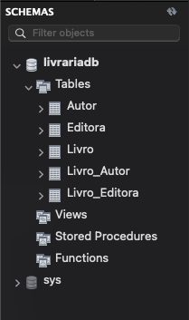
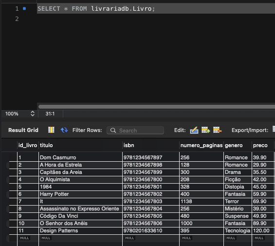
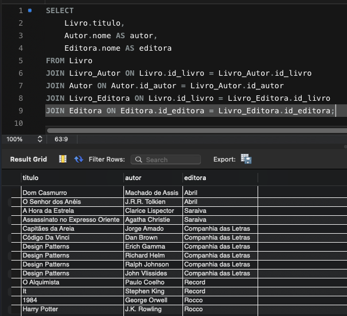

# banco-livros
Modelo relacional de uma loja de livros com as entidades Livro, Autor e Editora, incluindo relacionamentos N:N.

- Livro_Autor: relacionamento N:N entre livros e autores
- Livro_Editora: relacionamento entre livros e editoras

### Como executar
1. Execute create_tables.sql
2. Execute inserts.sql
3. Execute consultas.sql

### Estrutura das Tabelas

A imagem abaixo mostra a estrutura de tabelas

<table>
  <tr>
    <th>Lista de Livros</th>
    <th>Consulta com JOIN</th>
  </tr>
  <tr>
    <td></td>
    <td></td>
  </tr>
</table>
